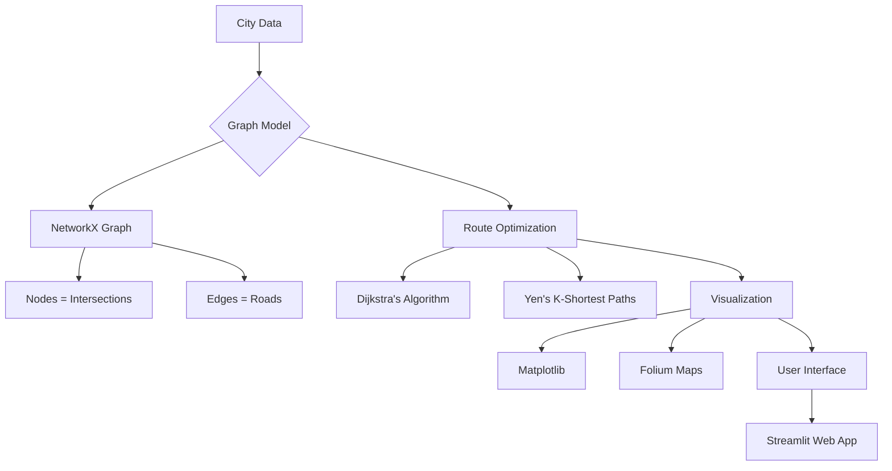

# 🚦 Traffic Management and Route Optimization System


A sophisticated traffic management system that models city road networks as graphs and applies Dijkstra's algorithm for optimal route finding, with real-time traffic visualization and dynamic congestion modeling.

## 📊 System Architecture

    
## 🌟 Features

### Core Functionality
- **Graph-based City Modeling**: Nodes as intersections, edges as roads with customizable weights
- **Optimal Path Finding**: Dijkstra's algorithm implementation with multiple weight considerations
- **Multiple Route Options**: Yen's algorithm for k-shortest paths (top 3 alternatives)

### Visualization Features
- **Interactive Traffic Heatmap**: Color-coded edges (green=fast, red=congested)
- **Dynamic Congestion Zones**: Manually adjust congestion levels
- **Time-based Weighting**: Automatic weight adjustments by time of day
- **Path Highlighting**: Clear visualization of recommended routes

### Advanced Features
- **Traffic Alert System**: Automatic congestion detection and alerts
- **User Reporting**: Crowd-sourced traffic updates
- **Export Functionality**: PDF route summaries with detailed information

)


## 🛠️ Installation

1. Clone the repository:
   ```bash
   git clone https://github.com/YasirAhmed2/Smart-Traffic-Routing-System.git
2. Install Dependencies
   ```bash
   pip install -r requirements.txt

4. Run application
streamlit run app.py

## 🤝 Contributing
Contributions are welcome! Please follow these steps:

- Fork the project
- Create your feature branch 
  ```bash
  git checkout -b feature/AmazingFeature 
- Commit your changes
  ```bash
  git commit -m 'Add some amazing feature'  
- Push to the branch
  ```bash
  git push origin feature/AmazingFeature  
- Open a Pull Request
